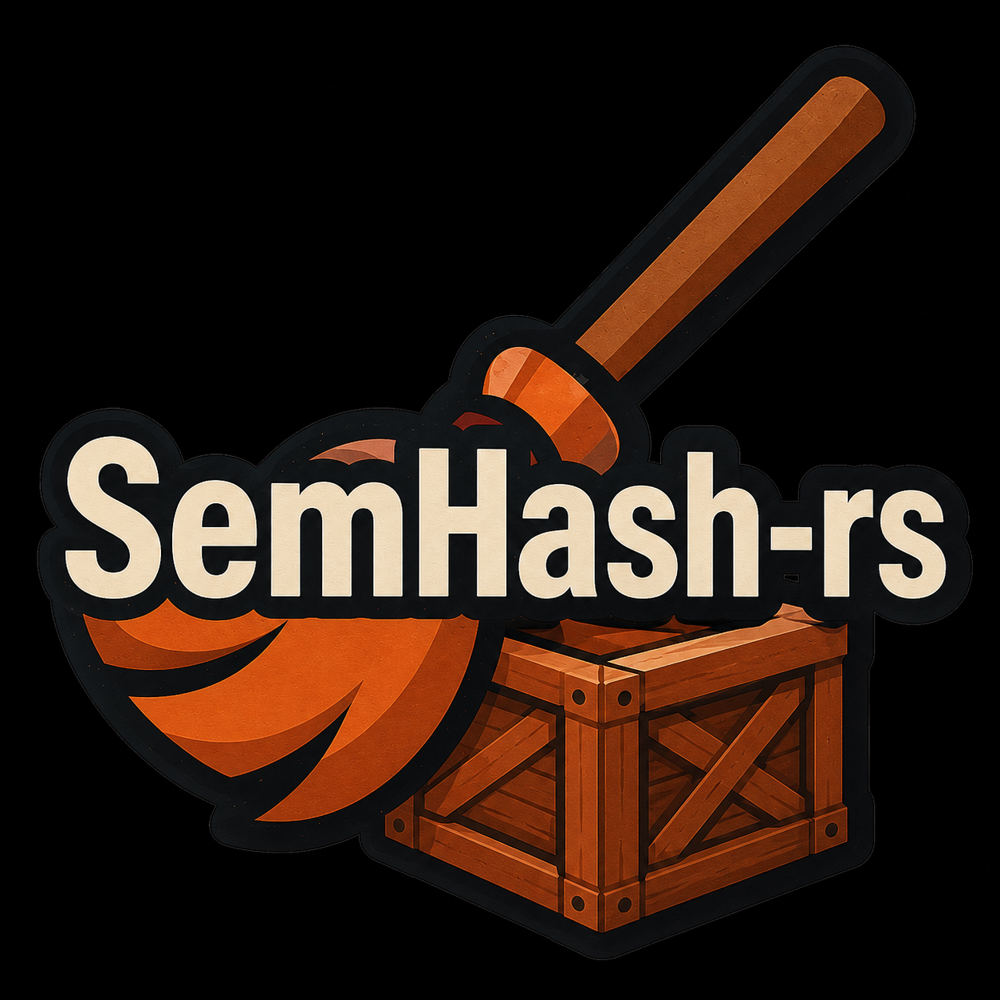

<h2 align="center">
  <br/>
  Fast Semantic Hashing for Code Search<br/>
  <sub>Rust implementation of Semantic Hashing</sub>
</h2>

A strict Rust port of the public API shape of [`MinishLab/semhash`](https://github.com/MinishLab/semhash): semantic deduplication, outlier filtering, and representative sample selection.

This repository keeps the Rust port, parity harness, and repo-hygiene checks
in one place so the published docs and metadata remain CI-safe.

The Python package exposes `SemHash.from_records`, `SemHash.from_embeddings`, `deduplicate`, `self_deduplicate`, `filter_outliers`, `self_filter_outliers`, `find_representative`, `self_find_representative`, `DeduplicationResult`, `DuplicateRecord`, `SelectedWithDuplicates`, `FilterResult`, `Index`, and helper modules. This crate mirrors those names and behaviors using Rust types.

## Important Rust differences

Python can accept `str`, `dict[str, Any]`, optional keyword arguments, NumPy arrays, and arbitrary encoder objects. Rust needs explicit types, so this port uses:

- `Record::Text(String)` for Python string records.
- `Record::Dict(BTreeMap<String, Value>)` for Python dictionary records.
- `Embeddings = Vec<Vec<f32>>` instead of NumPy arrays.
- `Arc<dyn Encoder>` for custom encoders.
- `SemHashOptions` for Python keyword arguments such as `columns`, `model`, and `ann_backend`.
- `CandidateLimit::Auto` / `CandidateLimit::Value(n)` for Python `candidate_limit="auto"`.

The Python package loads `minishlab/potion-base-8M` through Model2Vec when `model=None`. This port keeps the same callable API but uses a deterministic `HashingEncoder` fallback unless you pass your own `Encoder`. For production parity, pass an encoder backed by `model2vec-rs` or your own embeddings and use `SemHash::from_embeddings`.

The Python package routes similarity search through Vicinity. This crate preserves the `Backend` parameter but ships an exact cosine backend for deterministic, dependency-free behavior.

## Quick start

```rust
use semhash_rs::{Record, SemHash, SemHashOptions};

fn main() -> semhash_rs::Result<()> {
    let records = vec![
        Record::from("It's dangerous to go alone!"),
        Record::from("It's dangerous to go alone!"),
        Record::from("It's risky to go alone!"),
    ];

    let semhash = SemHash::from_records(records, SemHashOptions::default())?;
    let result = semhash.self_deduplicate(0.90)?;

    println!("selected = {:?}", result.selected);
    println!("filtered = {:?}", result.filtered);
    println!("duplicate_ratio = {}", result.duplicate_ratio());
    Ok(())
}
```

## Dictionary / multi-column records

```rust
use semhash_rs::{DictRecord, Record, SemHash, SemHashOptions, Value};

fn row(question: &str, context: &str, answer: &str) -> Record {
    let mut map = DictRecord::new();
    map.insert("question".to_string(), Value::from(question));
    map.insert("context".to_string(), Value::from(context));
    map.insert("answer".to_string(), Value::from(answer));
    Record::Dict(map)
}

fn main() -> semhash_rs::Result<()> {
    let records = vec![
        row("What is the hero's name?", "The hero is Link", "Link"),
        row("What is the hero's name?", "The hero is Link", "Link"),
        row("Who is the princess?", "The princess is Zelda", "Zelda"),
    ];

    let semhash = SemHash::from_records(
        records,
        SemHashOptions::default().columns(["question", "context", "answer"]),
    )?;

    let deduped = semhash.self_deduplicate(0.90)?;
    println!("kept {} records", deduped.selected.len());
    Ok(())
}
```

## Custom encoder

```rust
use semhash_rs::{Embeddings, Encoder, Result, Value};

struct MyEncoder;

impl Encoder for MyEncoder {
    fn encode(&self, inputs: &[Value]) -> Result<Embeddings> {
        Ok(inputs
            .iter()
            .map(|value| {
                let text = value.as_string_lossy();
                vec![text.len() as f32]
            })
            .collect())
    }
}
```

Use it with:

```rust
use semhash_rs::{Record, SemHash, SemHashOptions};
use std::sync::Arc;

# struct MyEncoder;
# impl semhash_rs::Encoder for MyEncoder {
#     fn encode(&self, inputs: &[semhash_rs::Value]) -> semhash_rs::Result<semhash_rs::Embeddings> {
#         Ok(inputs.iter().map(|v| vec![v.as_string_lossy().len() as f32]).collect())
#     }
# }
# fn main() -> semhash_rs::Result<()> {
let semhash = SemHash::from_records(
    vec![Record::from("apple"), Record::from("banana")],
    SemHashOptions::default().model(Arc::new(MyEncoder)),
)?;
# Ok(())
# }
```

## API map

| Python | Rust |
|---|---|
| `SemHash.from_records(records, columns=None, model=None, ann_backend=Backend.USEARCH)` | `SemHash::from_records(records, SemHashOptions::default().columns(...).model(...).ann_backend(...))` |
| `SemHash.from_embeddings(embeddings, records, model, columns=None, ann_backend=...)` | `SemHash::from_embeddings(embeddings, records, model, options)` |
| `semhash.deduplicate(records, threshold=0.9)` | `semhash.deduplicate(records, 0.9)` |
| `semhash.self_deduplicate(threshold=0.9)` | `semhash.self_deduplicate(0.9)` |
| `semhash.filter_outliers(records, outlier_percentage=0.1)` | `semhash.filter_outliers(records, 0.1)` |
| `semhash.self_filter_outliers(outlier_percentage=0.1)` | `semhash.self_filter_outliers(0.1)` |
| `semhash.find_representative(records, selection_size=10, candidate_limit="auto", diversity=0.5, strategy=Strategy.MMR)` | `semhash.find_representative(records, 10, CandidateLimit::Auto, 0.5, Strategy::MMR)` |
| `semhash.self_find_representative(...)` | `semhash.self_find_representative(...)` |
| `DeduplicationResult.selected_with_duplicates` cached property | `DeduplicationResult::selected_with_duplicates(&mut self)` cached method |

## Test

```bash
cargo build --release
cargo test --release
python3 scripts/verify_repo_hygiene.py
```

The included tests cover deduplication, cross-dataset deduplication, multi-column records, exact duplicate grouping, result inspection, rethresholding, outlier filtering, representative sampling, `from_embeddings`, and utility semantics.

## Reference benchmark

The cross-repo parity benchmark requires an explicit Python checkout instead of
assuming a machine-local directory:

```bash
python3 scripts/benchmark_reference_parity.py --reference-repo ../semhash
```

You can also set `SEMHASH_REFERENCE_REPO` in the environment and omit the
flag.

## License

This repository is licensed under ISC. See [LICENSE](LICENSE).

The bundled third-party license text is in
[THIRD_PARTY_LICENSE](THIRD_PARTY_LICENSE).
